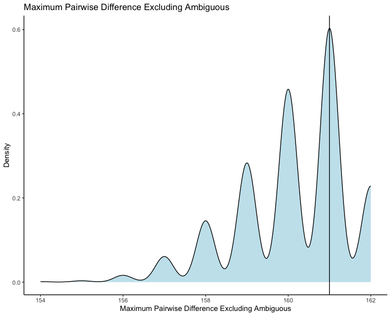

## Tutorial to use functions from PPS.Analysis.

You might have already seen the introduction section of the website. It gives you a hint on what the data looks like. 
So let's get started by downloading the simulated data set and the empirical data set. These data contain the summary statistics of the simulated and empirical data generated by a Bayesian phylogenetic software called `RevBayes`. 

The data to this tutorial can be found here. 

[Simulated Data](https://raw.githubusercontent.com/basanta33/PPS.Analysis/main/data/simulated_data_pps_data.csv) 

[Empirical Data](https://raw.githubusercontent.com/basanta33/PPS.Analysis/main/data/empirical_data_pps_data.csv)

Download these files and put it in a folder called 'data'. 

```{r eval = FALSE}
download.file(url = "https://raw.githubusercontent.com/basanta33/PPS.Analysis/main/data/simulated_data_pps_data.csv", destfile = "data/simulated_data_pps_data.csv")
download.file(url = "https://raw.githubusercontent.com/basanta33/PPS.Analysis/main/data/simulated_data_pps_data.csv", destfile = "data/simulated_data_pps_data.csv")
```

As the package depends on some other R packages, we need to load it into the library first. 

```{r eval = FALSE}
library(tidyverse)
library(janitor)
library(ggplot2)
library(PPS.Analysis)
```

#### Function 1: Renaming the Columns

If we open the csv files containing the data I generated, first we notice that the names of columns are really well-written which makes it uneasy to work with codes, so the first thing we'll be doing is renaming the columns of the csv files. 

My first function reads the data and changes the names of columns to a more code-friendly one.  

```{r eval=FALSE}
simdata <- rename_col("../data/simulated_data_pps_data.csv")

empdata <- rename_col("../data/empirical_data_pps_data.csv")
```

Let's take a look at the data.
```{r eval = FALSE}
View(simdata)

View(empdata)
```
In addition to cleaning the names for the data read in the environment, it also saves the column-changed data to a csv file. 

***

#### Function 2: Removing Unnecessary Columns

As we take a look at the cleaned data file, we see that it contains a lot of columns, most of which having all the values 0. The data was generated using morphological character sets so we would not have certain summary statistics like GC content (which is one of the valuable summary statistics for molecular sequence). So, the second function I have will get rid of the columns that we do not need.

```{r eval = FALSE}
simdata <- remove_blank(simdata)

empdata <- remove_blank(empdata)
```

Now if we View the data sets, we can see that the unnecessary columns have been removed and it also saves another csv file with the reduced data set. 

```{r eval = FALSE}
View(simdata)

View(empdata)
```
***

#### Function 3: Linear Model between two columns of the data set
For the third function I have here, it looks at the linear relationship of any two columns that you desire. For this we'd be looking at the simulated summary stats data and we can compare any of the columns from the data. This way we can view how related are the two columns linearly in our distribution of the data.   

```{r eval = FALSE}
linear_model(simdata, simdata$tajima_d, simdata$tajima_pi)
```
***

#### Function 4: Effect Size Calculation 
This is a measure of sample-based estimate for the variable. It can show a meaningful relationship between the empirical and simulated columns. 
It can manually be calculated using the following equation:

$d = \frac{x_1 - x_2}{s}$


This is also known as Cohen's d formula. It is designed to compare two groups. It takes the difference between two means and expresses it in standard deviation units. It tells you how many standard deviations lie between the two means.

As a general rule of thumb, effect size can be interpreted as following:

+ Small Effect = 0.2

+ Medium Effect = 0.5

+ Large Effect = 0.8 

In our case, we use the median of the simulated column and as the empirical column has only one value, we use that to calculate the effect size. 
The column of empirical data and simulated data should be the same to obtain the 'accurate' effect size.

```{r eval = FALSE}
effect_size(simdata$tajima_pi, empdata$tajima_pi)  
```

This is the effect size for the column Tajima's Pi. The value we obtain here is greater than 0.8, so we can conclude that the effect size is large. 
***

#### Function 5: Plotting 

The final function in my package is to visualize the distribution of the columns, for this we can create a density plot of the columns with a line of the empirical value. This will give us how aligned out simulated data values are with the empirical data value. 
```{r eval = FALSE}
plot <- den_plot(simdata, empdata$max_pairwise_difference_excluding_ambiguous, simdata$max_pairwise_difference_excluding_ambiguous, "Maximum Pairwise Difference Excluding Ambiguous")

plot
```

As we view the plot, we can see that the empirical data aligns where the simulated data is mostly distributed. So this means that our simulated data is close to the empirical data looking at this summary statistics. 

The plot should be looking something like this:


###### Thank you for following this tutorial!!
***
***
